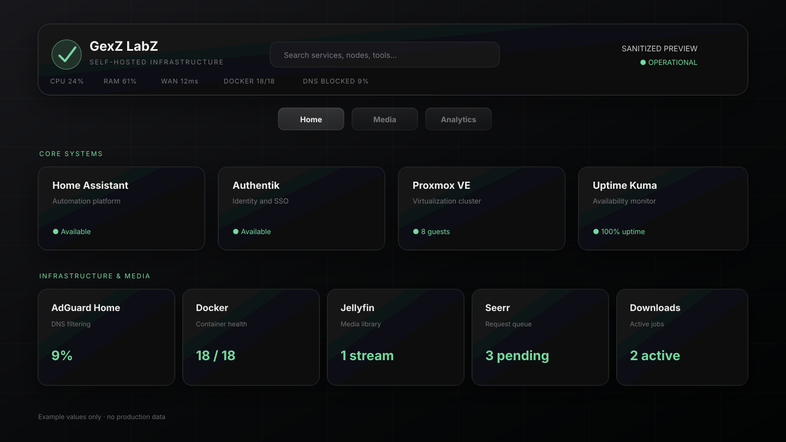

# GexZ LabZ Homepage

A heavily customized [Homepage](https://gethomepage.dev/) dashboard for a self-hosted lab: compact service cards, live health telemetry, media-pipeline status, search, and an analytics view.

> This repository is a sanitized public reference. It contains no production credentials, addresses, hostnames, device identifiers, logs, backups, or live screenshots.

  

## What is included

- Homepage YAML for core, infrastructure, media, and quick-launch groups
- the GexZ LabZ CSS theme and custom JavaScript views
- localhost-only Python collectors for health, storage, Docker, DNS, media, and Prometheus data
- hardened example systemd services and an nginx routing example
- one environment-variable template for Homepage and the collectors

Production-only logs, backups, generated status data, bytecode, local paths, third-party wallpapers, and the internal endpoint drawer are deliberately excluded.

## Requirements

- a current Homepage installation
- Python 3.10 or newer for the optional collectors
- `ping` for WAN-latency checks
- nginx or another reverse proxy if the custom API views are enabled
- the source services you choose to connect, such as Prometheus, Grafana, AdGuard Home, Sonarr, Radarr, Jellyfin, or qBittorrent

## Quick start

1. Clone this repository locally.
2. Copy `config/` into your Homepage config directory.
3. Copy `public/custom.css`, `public/custom.js`, and `public/images/` into the matching Homepage config/public locations used by your installation.
4. Copy `.env.example` to a private file outside the repository and replace every `YOUR_*` value.
5. Start Homepage with that environment file.
6. If you want the Media and Analytics views, follow [INSTALL.md](docs/INSTALL.md) to install the collectors and reverse-proxy routes.

Homepage substitutes values such as `{{HOMEPAGE_VAR_JELLYFIN_API_KEY}}` at runtime. Do not replace those placeholders with real credentials inside YAML.

## Configuration

[CONFIGURATION.md](docs/CONFIGURATION.md) maps each variable to its consumer and explains which integrations are optional. The example hostnames use the reserved `.example` namespace and are intentionally non-functional.

The custom JavaScript expects these same-origin paths:

- `/api/grafana/*` for infrastructure metrics
- `/api/media/*` for media-pipeline data
- `/api/telemetry` for the compact header health strip

Without the collectors, Homepage's native cards still work; the custom views fail closed and display unavailable values.

## Helper scripts

The collectors are intentionally small and dependency-free:

- `grafana_bridge.py` queries Prometheus, Grafana, a restricted Docker proxy, SMART data, AdGuard Home, and NPMPlus health.
- `media_collector.py` aggregates media requests, queues, subtitle backlog, downloads, and Jellyfin counts.
- `telemetry_collector.py` builds a lightweight header snapshot and short in-memory history.

They bind to `127.0.0.1` by default, retain no credentials or long-term history, and use 15-second polling intervals unless overridden. See [HEALTH-SCRIPTS.md](docs/HEALTH-SCRIPTS.md).

## Customization

Edit service groups in `config/services.yaml`, change layout in `config/settings.yaml`, and tune the theme in `public/custom.css`. The public build intentionally omits the production LAN endpoint drawer and third-party wallpaper; add your own properly licensed background if desired.

## Security

- Keep the real environment file outside git and readable only by the service account.
- Keep collector ports on localhost; publish only the same-origin reverse-proxy routes.
- Use a restricted Docker socket proxy instead of exposing the Docker socket or unauthenticated Engine API.
- Put internet-accessible dashboards behind TLS and authentication, and set an exact `HOMEPAGE_ALLOWED_HOSTS` value.
- Review [SECURITY.md](SECURITY.md) before deploying or contributing.

## Credits and licensing

This project configures and extends [gethomepage/homepage](https://github.com/gethomepage/homepage), which is licensed separately under GPL-3.0. Homepage itself is not redistributed here. JetBrains Mono is loaded from Google Fonts and is available under the SIL Open Font License 1.1. See [THIRD_PARTY_NOTICES.md](THIRD_PARTY_NOTICES.md).

The configuration, scripts, CSS, JavaScript, and documentation in this repository are MIT-licensed. The GexZ LabZ name and logo remain brand assets and are not granted for reuse under the MIT license.
